### About:

This repository is filled mostly with python scripts that I used for data analysis while I was a graduate student working with Professor Allison Jaynes. 

The case studies themselves were usually handled in jupyter notebooks while the heavy duty lifting was done in the source .py files and then imported into the notebooks. However, as always, slowly over time the repository has sort of degraded in quality and is probably in proper need of a refactoring. There are files in here for working with a machine learning model on an imbalanced dataset, simulating radial diffusion using the 1-D Fokker Planck equation, investigating alfven waves, and plotting radial phase space density profiles.

### Chorus Machine Learning Project:

The project I had spent the most time on was predicting the chorus power measured by EMFISIS on the Van Allen Probes, using low-earth orbit electron flux measurements from POES and geomagnetic indices (Kp, SME). This was a hard problem because of the heteroscedasticity of the raw data, and also the lack of conjunctions between EMFISIS and POES. I was unable to fix the problem to my satisfaction using transformations (box-cox, log, etc), weights, or a loss function that lets the variance be variable (see https://docs.pytorch.org/docs/stable/generated/torch.nn.GaussianNLLLoss.html). This meant the residuals were not normal and the dataset was heavily imbalanced.

This is the average distribution that EMFISIS measured during the Van Allen Probes Lifetime. The model I developed should essentially be able to accurately predict deviations from this average using the extra information from POES and indices.

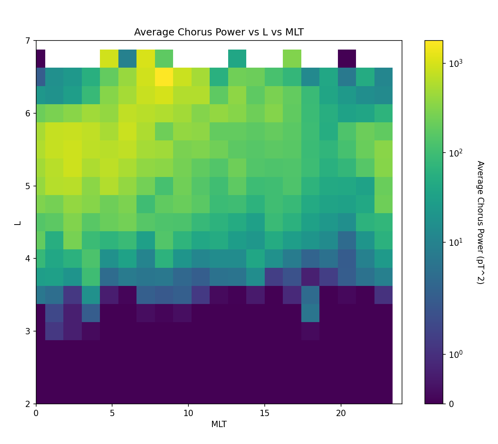

This is how the best model performed on training and testing sets after making sure data was not being leaked. I believe the best model was a boosted gradient random forest, used the electron density data from EMFISIS as input, SME as input, the fluxes as input, as well as transformed MLT and L. The model parameters were optimized using a grid search. 

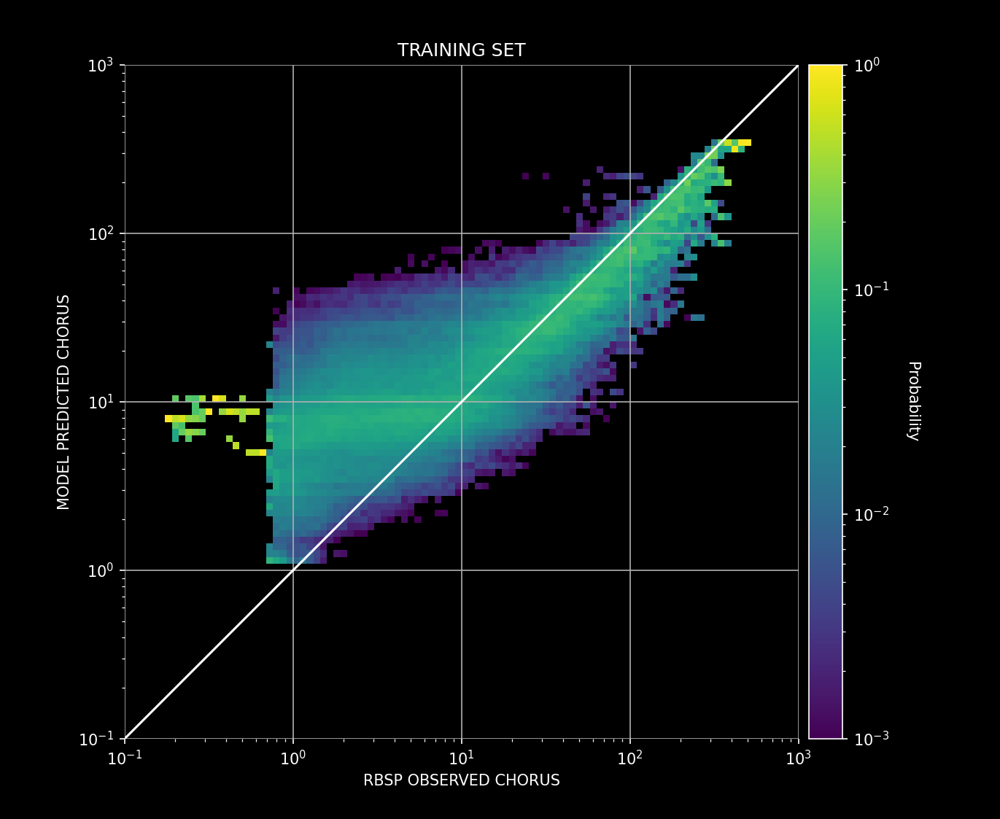
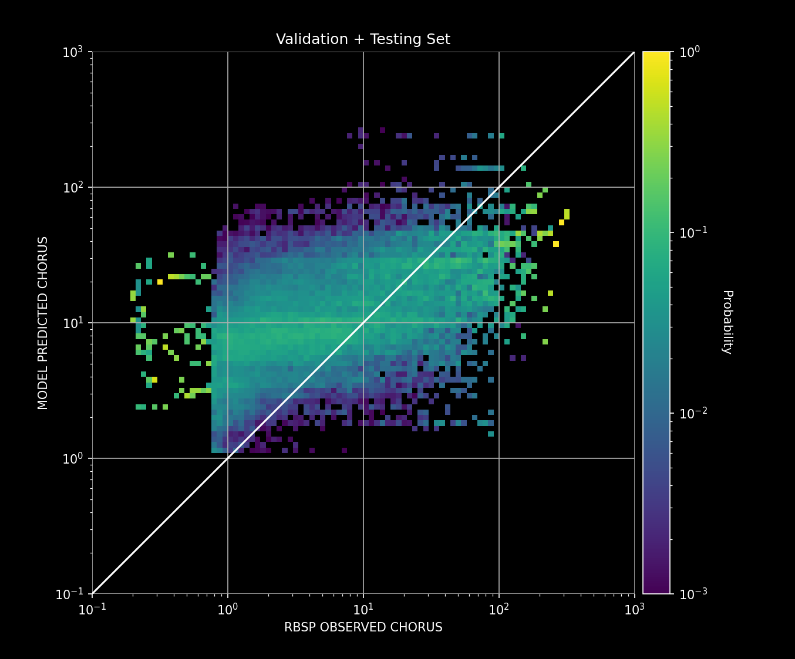

The best models appeared to do well on a hold out set.

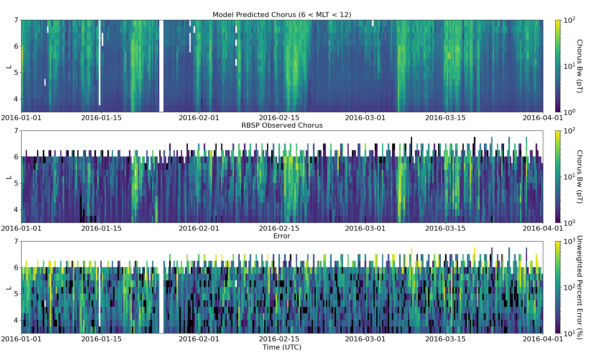

For comparison, this is the output from a traditional POES proxy using least squares to find the optimal P value for each time series point. Obviously the chorus is overestimated at low L values.

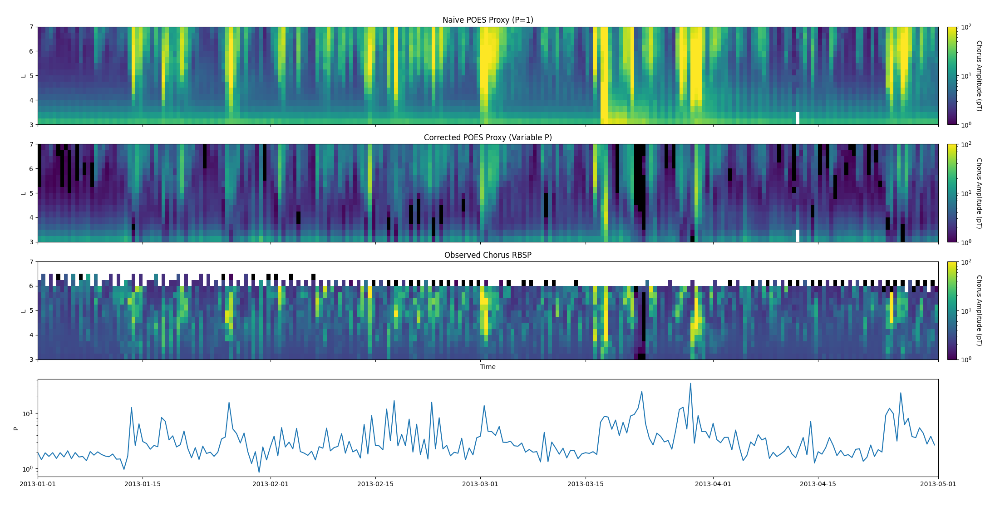

I had found an interesting similarity between the optimal P value used in the POES proxy, Kp, and flow speed. I believe this is due to the plasmapause moving and only looking at L in the outer belt.

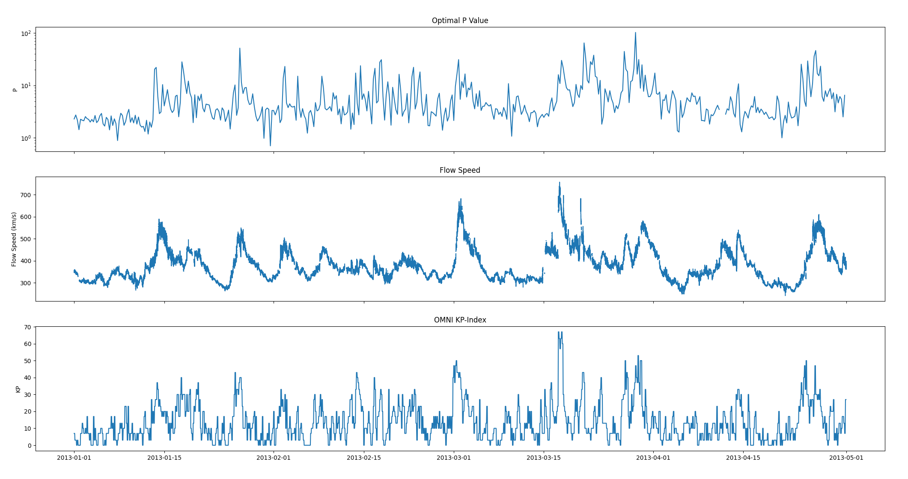

The models appeared to capture the expected chorus power distribution in L and MLT space.

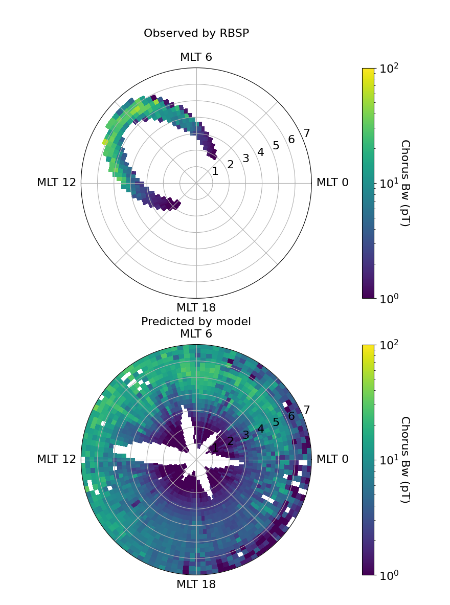

Here is how the best model performed when I used it to look at the past few solar cycles.

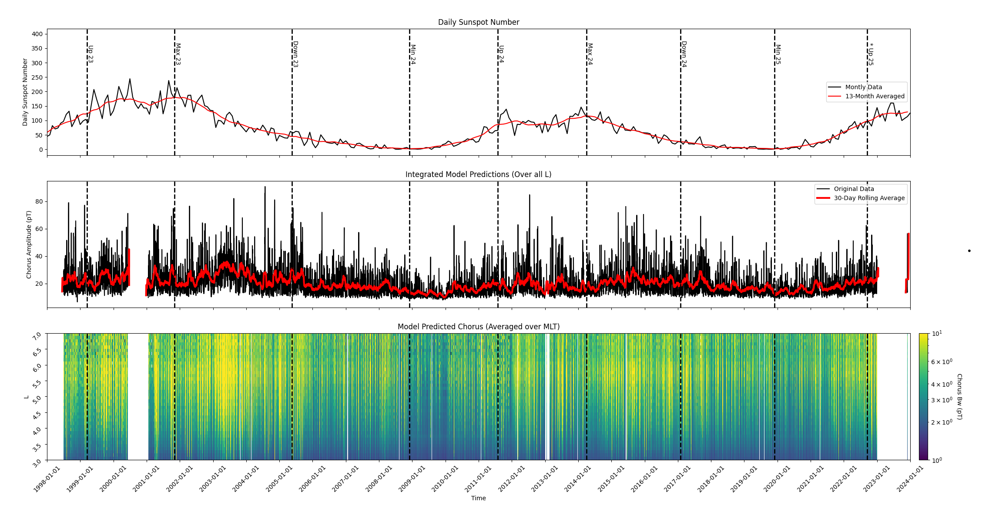

Summing the chorus (literally adding the columns in the plot above) in each month, and then doing statistics with the total cumulative chorus in each month:

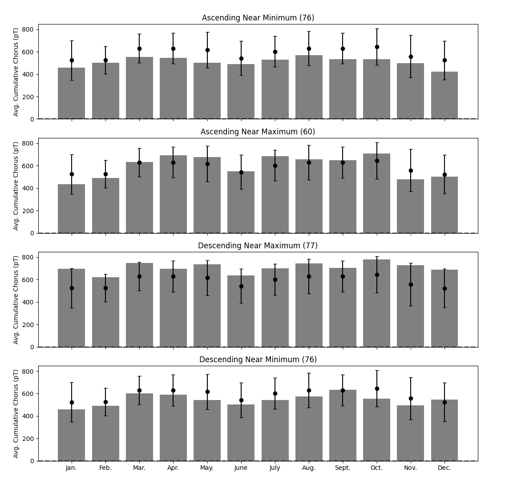

Transforming to the standard deviations from the mean for each month looked like this:

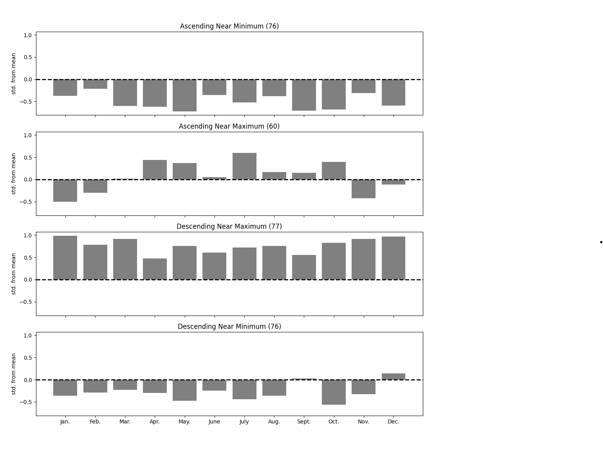

Interestingly, that looked very similar to what Tsurutani and his student had found for the relative occurence of HILDAA events, suggesting a relationship between HILDCAA events and increased global chorus power. The evidence here suggests that during the declining phase of the solar cycle, more HILDCAA events occur than during other parts of the solar cycle. 

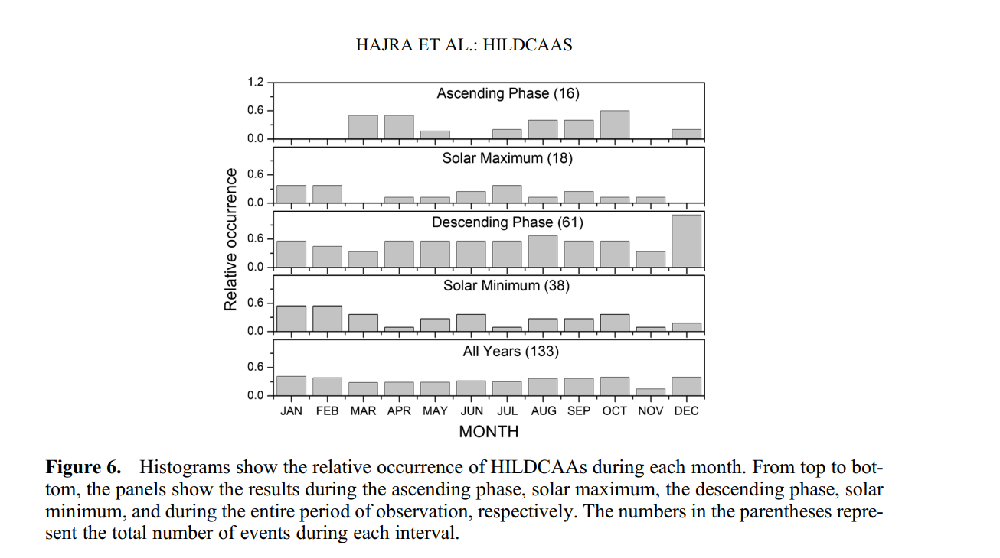

### Diffusion Coefficient Simulation:

Another project I worked on during this time was creating a simulation that uses the 1-D fokker-planck equation to model radial diffusion in Earth's outer belt. This diffusion simulation used real data points from the Van Allen Probes as initial conditions. Here is how the simulation looked using brautigam and alberts diffusion coefficients on an electron enhancement event in 2013 when there was almost no chorus.

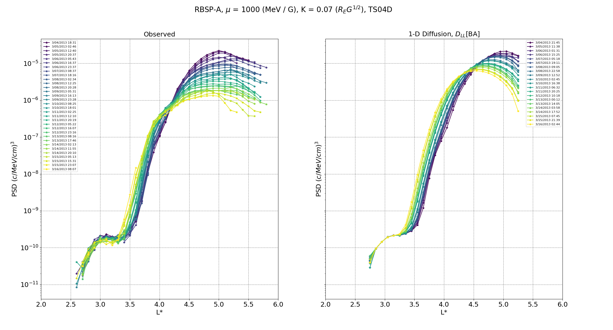

